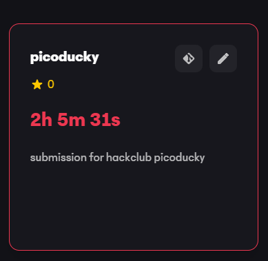
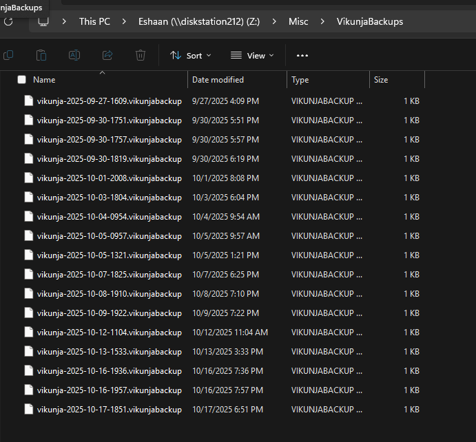
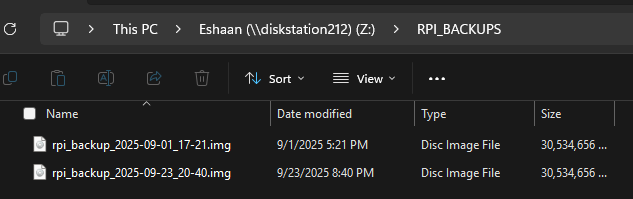

picoducky submission!

:thumbs up emoji:

I saw someone get a extra Picoducky for submitting early and i was lwk wondering if i could get one too, this is in the first week like you said :)

My plan is to use one picoducky for being a menace at school and one picoducky for backups at home (too lazy to open a terminal and remember what to backup, so id like to just plug smth in and have it backup everything to the NAS, I like backups bc ive been burned by data loss before, which is why I'm doing this in the first place)

I host a Viknuja server for some friends that i would liek to automate the backup process of ([file](/backup.py)). Right now, the file backs up my Vikunja server and rpi, pulls and updates the backup clones of my git repos (I have a main ver on my computer that i edit but I always forget to pull to the nas, which kinda defeats the purpose of the backup), checks pi temps, updates libraries on said pi, just the general housekeeping stuff that I always forget to do. Once its all done it'll make a new text file with the output of the backup if there were any errors

The other Picoducky I plan to use to use for school ([file](/backup.py)).

The file I have written right now rotates the screen, switches the language, flashes the signout prompt, opens 1000 tabs (our chromebooks are not good, especially the ones in electives, so I'm rely curious how this works, esp with how fast a terminal can execute commands compared to me mashing ctrl+t), then fullscreen locks a base64 image of a broken screen, so the chromebook freezes (bc tabs) on an image of a broken screen, and it has to be powercycled to be fixed (nothing harmful js annoying, it'll be fixed with a restart lmao)

Hackatime screenshot (just a little over 2 hours, most of that being me remembering how the os library works again [I main java lmao]):

Interestingly, my school blocks hack club servers on school wifi, so like 30 min were lost due to my hackatime extension failing due to lack of VPN, oh well I still have enough tho (right? two hours were the min last I checked...)

Demo:

- The backup system works fine manually for backing up all the vikunja data and the raspi disk images [I don't trust the cheap SD card it boots off of right now and I don't feel like installing a M.2 Hat to boot it off a proper nvme], so the terminal command works, all this does it automate it

Screenshot of past backup commands working

Demo video of backup, proving the python works by me just running it manually (I don't have a raspi pico but it'll do the same thing if it was ran from a pico/picoducky) [turns out this is 74 mb lmao ur gonna have to download it to view it :crying emoji: idk why the file size is so large]

- I don't have a chromebook to test the menace program on, and the shortcuts are different on windows (what im writing this on, though i want to install linux once I get the chance) compared to chromebook (what I wrote this for), so I cant just run the file to test it like I did the backup program

ps. I listened to Hollow Knight OST for this entire project you should try some if you haven't, the gods and nightmares DLC is also peak (see what I did there [crystal peak is a place in HK])
